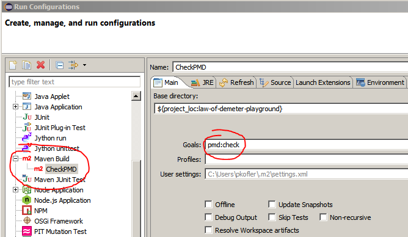
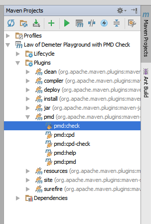

## Law Of Demeter Playground with PMD Check ##

This is an [Apache Maven](https://maven.apache.org/) project. Run `mvn test` to
run your tests. [JUnit](http://junit.org/) is provided as dependency.

## Constraint ##

[Law Of Demeter](http://www.ccs.neu.edu/home/lieber/LoD.html).

### Checking Code for Compliance ###

PMD contains a rule `LawOfDemeter` to check code for compliance with Law Of Demeter.
This project is set up to check the code using the Maven PMD Plugin on each `mvn test`.
You can also check the rules on their own with `mvn pmd:check`.
By using the [Maven Shell](https://github.com/jdillon/mvnsh) the time to run the check can be reduced by 50%.

In Eclipse, use `Run As/Maven build...` and see the violations in the Console:

In IntelliJ IDEA, use `Maven Projects/Plugins/pmd/pmd:check` and see the violations in the Console:

### Limitations of Checking Code ###
Obviously code analysis cannot find everything.

You can use `// NOPMD` line comments and `@SuppressWarnings("PMD.LawOfDemeter")` annotations to suppress false positives.
Use your good judgement. The goal is to follow the law, not to suppress it.

### License ###
This work is licensed under a [New BSD License](http://opensource.org/licenses/bsd-license.php), see `license.txt` in repository.
